# سيناريو ربط تطبيق Flutter مع جهاز البصمة

يشرح هذا المستند آلية وتدفق البيانات لعملية الاتصال بين واجهة **Flutter**، خادم الباك إند المبني بإطار **FastAPI**، وجهاز البصمة الفعلي من نوع **ZKTeco**.

تنقسم العملية إلى مسارين أساسيين لتلبية احتياجات النظام:

---

## 1. مسار العمليات المباشرة (مثل الإضافة، الحذف، وجلب البيانات)
يُستخدم هذا المسار للعمليات الإدارية التي تتطلب استجابة فورية لبيانات مخزنة على جهاز البصمة نفسه (مثل سحب قوالب البصمات، أو إضافة مستخدم جديد للجهاز).

1. يُرسل تطبيق **Flutter** طلب `HTTP` عادي إلى الباك إند (مثال: `GET /api/devices/1/users`).
2. يقوم **الباك إند (FastAPI)** بفتح اتصال مؤقت (`TCP/UDP` على المنفذ `4370`) مع جهاز البصمة الفعلي.
3. يقوم الجهاز بتنفيذ العملية (جلب البيانات أو التعديل) وإرجاع النتيجة للباك إند.
4. يقوم الباك إند بإغلاق الاتصال مباشرة لتوفير موارد الجهاز، ثم يرسل البيانات كـ `JSON` إلى تطبيق Flutter ليتم عرضها للمستخدم.

---

## 2. مسار الاستماع المباشر للبصمات الحية (Live Capture)
يُستخدم هذا المسار في شاشات المراقبة المباشرة في واجهة المستخدم، حيث نحتاج لعرض بصمة الموظف فور وضع إصبعه على الجهاز بدون الحاجة لتحديث الصفحة يدوياً.

1. تقوم شاشة المراقبة في **Flutter** بفتح اتصال دائم وثنائي الاتجاه عبر الـ **WebSocket** مع الباك إند على المسار `ws://<backend_url>/api/ws/devices`.
2. يُرسل تطبيق Flutter رسالة نصية تطلب الاشتراك في جهاز معين: `{"type": "register", "device_id": 1}`.
3. يقوم **الباك إند** باستقبال الطلب، ويفتح اتصالاً دائماً بالخلفية (Background Task) مع جهاز البصمة ويبقى في حالة استماع (Listening) لأي حدث جديد (`live_capture`).
4. عندما **يبصم موظف** على الجهاز، يُرسل جهاز البصمة نبضة للباك إند فوراً.
5. يقوم الباك إند بتمرير هذه النبضة (حركة الحضور) مباشرة عبر قناة الـ `WebSocket` المفتوحة لتطبيق Flutter بصيغة:
   `{"type": "biometric_data", "biometric_id": "1005", "timestamp": "..."}`
6. يستقبل Flutter البيانات ويقوم بتحديث الواجهة (UI) في غضون أجزاء من الثانية.

---

## مخطط مسار العمليات (Sequence Diagram)

يوضح المخطط الزمني أدناه التفاعل بين المكونات الثلاثة: **تطبيق Flutter** ↔ **خادم FastAPI** ↔ **جهاز البصمة**.

```mermaid
sequenceDiagram
    autonumber
    actor HR as مستخدم النظام (Flutter)
    participant Flutter as تطبيق Flutter
    participant FastAPI as خادم الـ Backend (FastAPI)
    participant ZKTeco as جهاز البصمة (ZKTeco)

    %% مسار عمليات CRUD المباشرة
    rect rgb(30, 40, 50)
    note right of HR: 1. العمليات المباشرة (جلب، إضافة مستخدمين أو قوالب)
    HR->>Flutter: يضغط "عرض مستخدمي الجهاز"
    Flutter->>FastAPI: HTTP GET /api/devices/1/users
    FastAPI->>ZKTeco: فتح اتصال (Connect) واستدعاء get_users()
    ZKTeco-->>FastAPI: إرجاع قائمة مستخدمي الجهاز
    FastAPI->>ZKTeco: إغلاق الاتصال (Disconnect)
    FastAPI-->>Flutter: إرجاع البيانات بصيغة (JSON)
    Flutter-->>HR: عرض قائمة المستخدمين في الواجهة
    end

    %% مسار الاستماع المباشر عبر WebSockets
    rect rgb(20, 50, 40)
    note right of HR: 2. عملية الاستماع المباشر (Live Capture)
    HR->>Flutter: يفتح "شاشة المراقبة المباشرة"
    Flutter->>FastAPI: فتح اتصال WebSocket 
    FastAPI-->>Flutter: تأكيد الاتصال
    Flutter->>FastAPI: إرسال {type: "register", device_id: 1}
    FastAPI->>ZKTeco: إنشاء Task بالخلفية والاتصال بالجهاز 
    ZKTeco-->>FastAPI: اتصال ناجح ويبدأ دالة live_capture()
    FastAPI-->>Flutter: تأكيد الاشتراك {type: "registered"}
    
    note over ZKTeco: (الموظف رقم 1005 يضع إصبعه على الجهاز)
    ZKTeco-->>FastAPI: إرسال حركة حضور فورية للباك إند
    FastAPI-->>Flutter: بث الحركة عبر الـ WebSocket {type: "biometric_data"}
    Flutter-->>HR: تحديث واجهة المستخدم بالحضور فوراً!
    end
```

