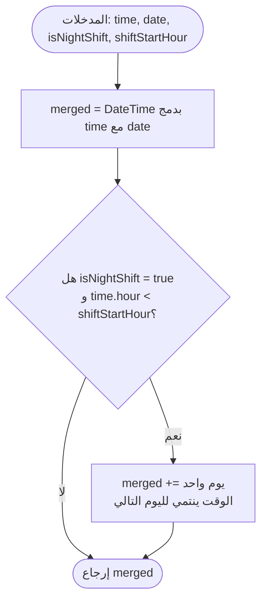
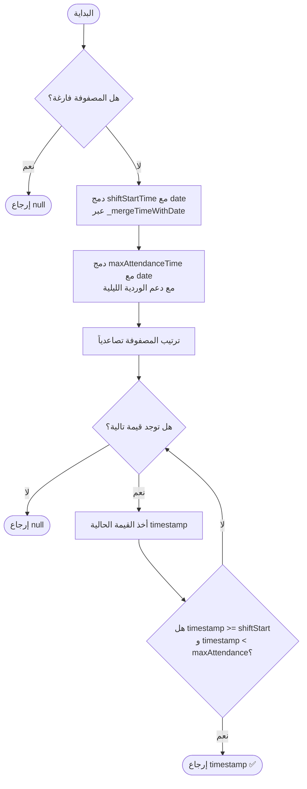
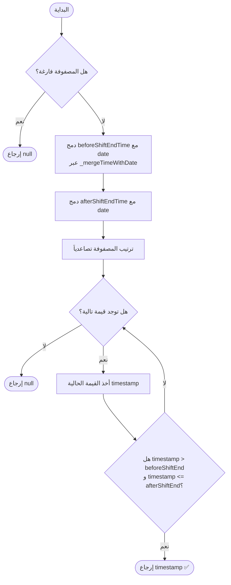
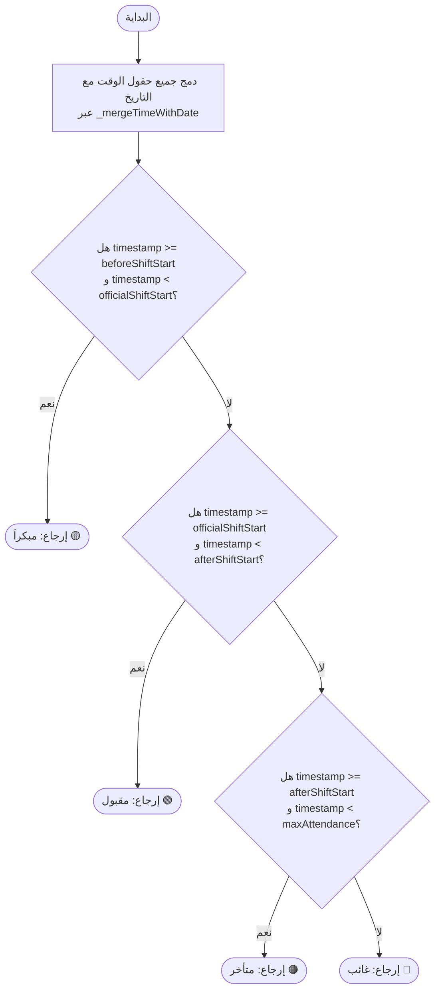
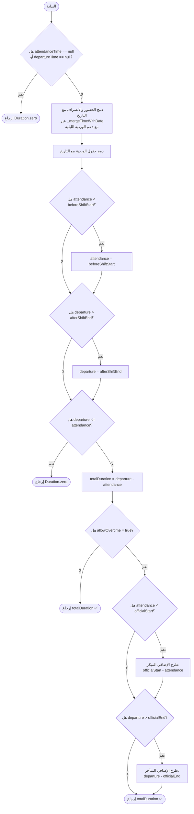
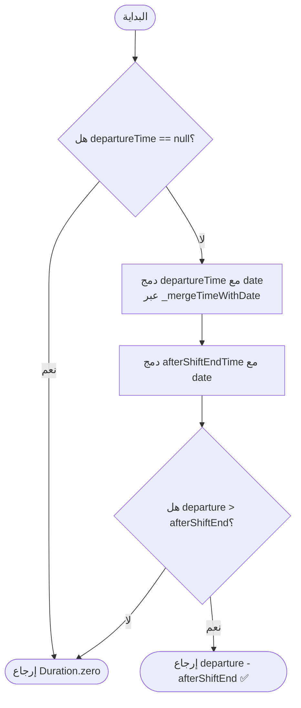
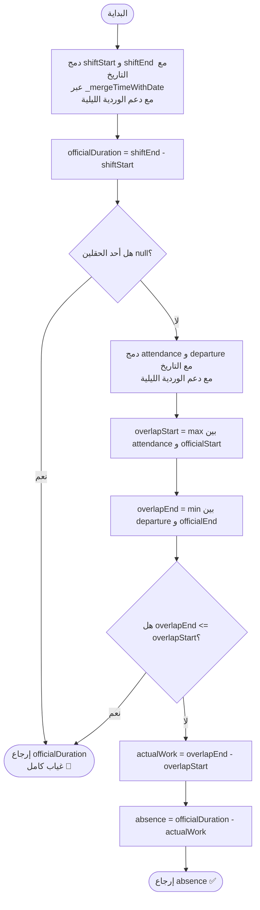
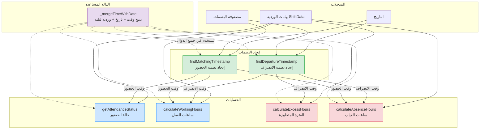

# توثيق دوال حساب الوقت - CalculateTime

## نظرة عامة

يحتوي كلاس `CalculateTime` على دالة مساعدة و 5 دوال أساسية لإدارة حسابات الحضور والانصراف.
جميع الدوال تدعم **الوردية النهارية والليلية** عبر الدالة المساعدة `_mergeTimeWithDate`.

---

## دعم الوردية الليلية

### المشكلة
في الوردية الليلية (مثل 22:00→06:00) تكون أوقات النهاية **رقمياً أصغر** من أوقات البداية:
```
نهارية: 07:00 ────────── 15:00  ✅ (shiftEnd > shiftStart)
ليلية:  22:00 ── 00:00 ── 06:00  ❌ (shiftEnd < shiftStart)
```

### الحل: `_mergeTimeWithDate`



### كيف يعمل
إذا كانت الوردية ليلية والوقت أصغر من ساعة بداية الوردية، يُضاف يوم واحد:

```
التاريخ: 2026-07-16 | الوردية: 22:00 → 06:00

beforeShiftStart 21:30 → 21 >= 22؟ لا  → July 16 21:30 ✅
shiftStart       22:00 → 22 >= 22؟ نعم → July 16 22:00 ✅
afterShiftStart  22:15 → 22 >= 22؟ نعم → July 16 22:15 ✅
maxAttendance    23:30 → 23 >= 22؟ نعم → July 16 23:30 ✅
beforeShiftEnd   05:30 →  5 >= 22؟ لا  → July 17 05:30 ✅ (+1 يوم)
shiftEnd         06:00 →  6 >= 22؟ لا  → July 17 06:00 ✅ (+1 يوم)
afterShiftEnd    06:30 →  6 >= 22؟ لا  → July 17 06:30 ✅ (+1 يوم)
```

### الخط الزمني

#### وردية نهارية
```
06:30      07:00     07:15     08:30     14:30     15:00     15:30
  |──────────|─────────|──────────|─────────|─────────|─────────|
  قبل       بداية    بعد بداية  الحد      قبل      نهاية    بعد نهاية
  البداية   الفترة   الفترة     الأقصى    النهاية   الفترة    الفترة
                      ── يوم واحد ──
```

#### وردية ليلية
```
يوم 1                                    يوم 2
21:30    22:00    22:15    23:30    │    05:30    06:00    06:30
  |────────|────────|────────|─────│──────|────────|────────|
  قبل     بداية   بعد بداية الحد  │     قبل     نهاية   بعد نهاية
  البداية  الفترة  الفترة   الأقصى│     النهاية  الفترة   الفترة
                                   منتصف الليل
```

---

## 1. findMatchingTimestamp - إيجاد بصمة الحضور

### الوصف
تبحث عن أول بصمة حضور تقع ضمن النطاق المسموح للدخول.

### المتغيرات المطلوبة

| المتغير | النوع | الوصف |
|---------|-------|-------|
| `timestamps` | `List<DateTime>` | مصفوفة أوقات البصمات |
| `date` | `DateTime` | التاريخ (بدون وقت) |
| `shiftStartTime` | `DateTime` | بداية فترة الوردية (وقت فقط) |
| `maxAttendanceTime` | `DateTime` | الحد الأقصى للحضور (وقت فقط) |

### الشرط
```
shiftStart <= القيمة < maxAttendance
```

### المخطط الانسيابي



### كيف يعمل
1. **فحص المصفوفة**: إذا كانت فارغة يرجع `null` فوراً
2. **الدمج**: يدمج أوقات الحقول مع التاريخ عبر `_mergeTimeWithDate` (مع إضافة يوم للوردية الليلية إذا لزم)
3. **الترتيب**: يرتب المصفوفة تصاعدياً لضمان إرجاع أول بصمة
4. **المطابقة**: يمر على كل قيمة ويتحقق من الشرط `>= shiftStart` و `< maxAttendance`
5. **الإرجاع**: يرجع أول قيمة مطابقة أو `null`

---

## 2. findDepartureTimestamp - إيجاد بصمة الانصراف

### الوصف
تبحث عن أول بصمة انصراف تقع ضمن نطاق نهاية الوردية.

### المتغيرات المطلوبة

| المتغير | النوع | الوصف |
|---------|-------|-------|
| `timestamps` | `List<DateTime>` | مصفوفة أوقات البصمات |
| `date` | `DateTime` | التاريخ (بدون وقت) |
| `beforeShiftEndTime` | `DateTime` | قبل نهاية الفترة (وقت فقط) |
| `afterShiftEndTime` | `DateTime` | بعد نهاية الفترة (وقت فقط) |

### الشرط
```
القيمة > beforeShiftEnd و القيمة <= afterShiftEnd
```

### المخطط الانسيابي



### الفرق عن دالة الحضور

| | الحضور | الانصراف |
|---|---|---|
| الحد الأدنى | `>=` مشمول | `>` غير مشمول |
| الحد الأقصى | `<` غير مشمول | `<=` مشمول |

---

## 3. getAttendanceStatus - حالة الحضور

### الوصف
تحدد حالة الحضور بناءً على الوقت: مبكراً، مقبول، متأخر، أو غائب.

### المتغيرات المطلوبة

| المتغير | النوع | الوصف |
|---------|-------|-------|
| `beforeShiftStartTime` | `DateTime` | الفترة المسموحة قبل الدخول (وقت فقط) |
| `officialShiftStartTime` | `DateTime` | بداية الفترة الرسمية (وقت فقط) |
| `afterShiftStartTime` | `DateTime` | الفترة المسموحة بعد الدخول (وقت فقط) |
| `maxAttendanceTime` | `DateTime` | الحد الأقصى للحضور (وقت فقط) |
| `date` | `DateTime` | التاريخ (بدون وقت) |
| `timestamp` | `DateTime` | الوقت المراد مطابقته |

### نطاقات الحالات
```
     مبكراً          مقبول         متأخر          غائب
|──────────────|──────────────|──────────────|──────────────→
beforeStart   officialStart  afterStart    maxAttendance
```

### المخطط الانسيابي



### كيف يعمل
1. **الدمج**: يدمج جميع حقول الوقت الأربعة مع التاريخ عبر `_mergeTimeWithDate`
2. **المطابقة المتسلسلة**: يتحقق من كل نطاق بالترتيب:
   - `[beforeShiftStart, officialShiftStart)` → **مبكراً**
   - `[officialShiftStart, afterShiftStart)` → **مقبول**
   - `[afterShiftStart, maxAttendance)` → **متأخر**
3. **الافتراضي**: إذا لم يطابق أي نطاق → **غائب**

---

## 4. calculateWorkingHours - ساعات العمل الفعلية

### الوصف
تحسب ساعات العمل الفعلية مع إمكانية إزالة فترة الإضافي.

### المتغيرات المطلوبة

| المتغير | النوع | الوصف |
|---------|-------|-------|
| `attendanceTime` | `DateTime?` | وقت الحضور (وقت فقط)، null = غائب |
| `departureTime` | `DateTime?` | وقت الانصراف (وقت فقط)، null = غائب |
| `date` | `DateTime` | التاريخ (بدون وقت) |
| `shiftData` | `ShiftData` | بيانات الوردية الكاملة |

### المخطط الانسيابي



### كيف يعمل
1. **فحص الحقول**: إذا أحد الحقلين `null` → يرجع `Duration.zero`
2. **الدمج**: يدمج جميع الأوقات مع التاريخ (مع دعم الوردية الليلية)
3. **التقييد**: يقيّد الحضور والانصراف ضمن `[beforeShiftStart, afterShiftEnd]`
4. **الحساب**: يحسب الفارق `departure - attendance`
5. **إزالة الإضافي** (إذا `allowOvertime = true`):
   - يطرح الفترة قبل `shiftStart` (إضافي مبكر)
   - يطرح الفترة بعد `shiftEnd` (إضافي متأخر)

### مثال عملي - وردية نهارية
```
حضور: 06:30 | انصراف: 15:30 | allowOvertime: true
├── إجمالي: 15:30 - 06:30 = 9 ساعات
├── إضافي مبكر: 07:00 - 06:30 = 30 دقيقة
├── إضافي متأخر: 15:30 - 15:00 = 30 دقيقة
└── ساعات العمل = 9 - 0:30 - 0:30 = 8 ساعات ✅
```

### مثال عملي - وردية ليلية
```
حضور: 21:30 (يوم 16) | انصراف: 06:30 (يوم 17) | allowOvertime: true
├── _mergeTimeWithDate(21:30) → July 16 21:30
├── _mergeTimeWithDate(06:30) → July 17 06:30  (+1 يوم)
├── إجمالي: 9 ساعات
├── إضافي مبكر: 22:00 - 21:30 = 30 دقيقة
├── إضافي متأخر: 06:30 - 06:00 = 30 دقيقة
└── ساعات العمل = 9 - 0:30 - 0:30 = 8 ساعات ✅
```

---

## 5. calculateExcessHours - الفترة المتجاوزة

### الوصف
تحسب الوقت الذي يتجاوز فيه الانصراف حقل `afterShiftEnd` (خارج نطاق الوردية بالكامل).

### المتغيرات المطلوبة

| المتغير | النوع | الوصف |
|---------|-------|-------|
| `departureTime` | `DateTime?` | وقت الانصراف (وقت فقط) |
| `date` | `DateTime` | التاريخ (بدون وقت) |
| `afterShiftEndTime` | `DateTime` | بعد نهاية الفترة (وقت فقط) |

### تمثيل التجاوز
```
                         نطاق الوردية                    تجاوز
|════════════════════════════════════════════|▓▓▓▓▓▓▓▓▓▓▓▓|
beforeStart                                afterEnd     departure
```

### المخطط الانسيابي



### كيف يعمل
1. **فحص الحقل**: إذا `departureTime == null` → `Duration.zero`
2. **الدمج**: يدمج الأوقات مع التاريخ عبر `_mergeTimeWithDate`
3. **المقارنة**: إذا الانصراف بعد `afterShiftEnd` → يحسب الفارق
4. **الإرجاع**: الفارق أو `Duration.zero`

---

## 6. calculateAbsenceHours - ساعات الغياب

### الوصف
تحسب عدد ساعات الغياب عن الفترة الرسمية.

### المتغيرات المطلوبة

| المتغير | النوع | الوصف |
|---------|-------|-------|
| `attendanceTime` | `DateTime?` | وقت الحضور (وقت فقط) |
| `departureTime` | `DateTime?` | وقت الانصراف (وقت فقط) |
| `date` | `DateTime` | التاريخ (بدون وقت) |
| `shiftData` | `ShiftData` | بيانات الوردية |

### المخطط الانسيابي



### كيف يعمل
1. **حساب مدة الوردية**: `officialDuration = shiftEnd - shiftStart` (يعمل بشكل صحيح للوردية الليلية لأن shiftEnd يكون في اليوم التالي)
2. **غياب كامل**: إذا أحد الحقلين `null` → يرجع كامل المدة
3. **حساب التقاطع**: يحسب الفترة المشتركة بين حضور الموظف والفترة الرسمية
4. **حساب الغياب**: مدة الوردية - الفترة الفعلية

### مثال عملي
```
الوردية الرسمية: 07:00 → 15:00 = 8 ساعات

الحالة 1: حضور null         → غياب = 8 ساعات (كامل)
الحالة 2: 07:00 → 15:00     → غياب = 0 (بدون غياب)
الحالة 3: 08:00 → 15:00     → غياب = 1 ساعة (تأخير)
الحالة 4: 07:00 → 14:00     → غياب = 1 ساعة (انصراف مبكر)
الحالة 5: 08:00 → 14:00     → غياب = 2 ساعات (تأخير + مبكر)
الحالة 6: 06:30 → 15:00     → غياب = 0 (المبكر لا يُحتسب)
```

---

## بيانات الوردية - ShiftData

### حقول الكلاس

| الحقل | النوع | الوصف |
|-------|-------|-------|
| `shiftStart` | `DateTime` | بداية الفترة الرسمية |
| `shiftEnd` | `DateTime` | نهاية الفترة الرسمية |
| `beforeShiftStart` | `DateTime` | قبل بداية الفترة (المسموحة قبل الدخول) |
| `afterShiftStart` | `DateTime` | بعد بداية الفترة (المسموحة بعد الدخول) |
| `maxAttendanceTime` | `DateTime` | الحد الأقصى للحضور |
| `beforeShiftEnd` | `DateTime` | قبل نهاية الفترة |
| `afterShiftEnd` | `DateTime` | بعد نهاية الفترة |
| `allowOvertime` | `bool` | هل تسمح الوردية بفترة إضافي |
| `isNightShift` | `bool` | هل هي وردية ليلية (تمتد بين يومين) |

### العلاقة بين الحقول

```mermaid
graph LR
    A["beforeShiftStart"] --> B["shiftStart"]
    B --> C["afterShiftStart"]
    C --> D["maxAttendanceTime"]
    D -.-> E["beforeShiftEnd"]
    E --> F["shiftEnd"]
    F --> G["afterShiftEnd"]

    style A fill:#FFF3CD,stroke:#FFC107
    style B fill:#D4EDDA,stroke:#28A745
    style C fill:#FFF3CD,stroke:#FFC107
    style D fill:#F8D7DA,stroke:#DC3545
    style E fill:#FFF3CD,stroke:#FFC107
    style F fill:#D4EDDA,stroke:#28A745
    style G fill:#FFF3CD,stroke:#FFC107
```



---

## العلاقة بين الدوال


